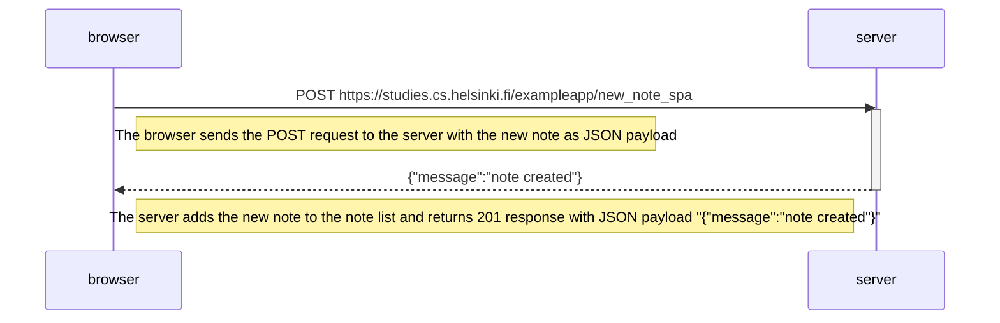

# 6. Uusi muistiinpano

```mermaid
sequenceDiagram
    participant browser
    participant server

    browser->>server: POST https://studies.cs.helsinki.fi/exampleapp/new_note_spa
    activate server
    Note right of browser:  The browser sends the POST request to the server with the new note as JSON payload
    server-->>browser: {"message":"note created"}
    deactivate server
    Note right of browser: The server adds the new note to the note list and returns 201 response with JSON payload "{"message":"note created"}"

```